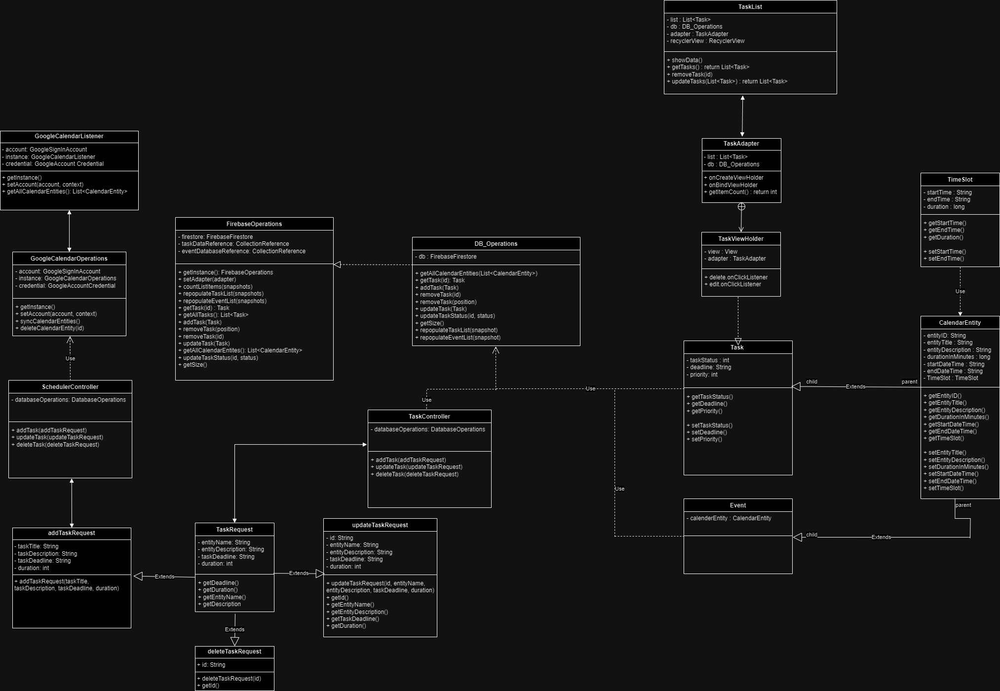
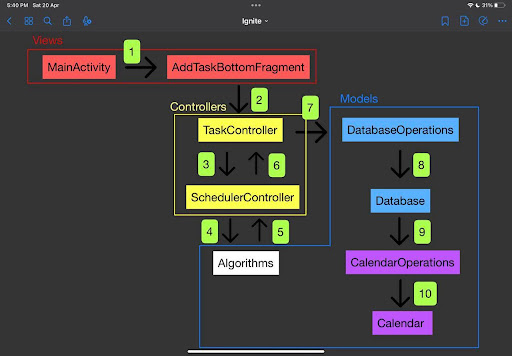

# EDITH
## 50.001 1D Project - TEAM 42
| Name                            | ID      | Roles                              |
| :------------------------------ | :-----: |:-----------------------------------|
| Lim Donggeon                    | 1007068 | UI/UX Design                       
| Vancence Ho                     | 1007239 | Front-End Development              
| Douglas Tan                     | 1006656 | Algorithm Design                   
| Lindero Dianthe Marithe Lumagui | 1007213 | Front-End Development                   
| Andrew Foo                      | 1007209 | Back-End Development               
| Chu Jeng Kuen                   | 1006920 | Algorithm Design
| David Ling De Wei               | 1007175 |Back-End Development                   
## Background
### Idea Inspiration
<div style="text-align: justify">
The concept of our app was sparked off by the desire of a very prominent matter to
everybody, saving time. It can be rather time-consuming to manually prioritise and
schedule our tasks around events that we have planned each day. Generally, it takes about 2 hours (but not limited to) weekly for individuals to plan their weekly schedules as well as their tasks, weekly it doesn't seem to be a long time considering we have 168 hours each week, and it only takes up only above 10% of our time. However, cumulatively, the amount of time spent could actually be used more efficiently, especially for individuals like us, students. 

As students, juggling numerous commitments can often feel overwhelming. The arduous task of manually organising and prioritising tasks around existing events not only consumes precious time but also adds unnecessary stress to already packed schedules.

Which lead to us thinking, what if there was a solution to alleviate this burden?
(Similar to how **JARVIS** plans schedules for **Tony**). We wanted an app that automates the entire process of task scheduling, revolutionising time management for students. With this innovative tool, everybody, not only students, can effortlessly input their tasks, and the app will seamlessly integrate them into their calendar, optimising schedules to maximise productivity and efficiency.

Inspired by this desire, our team envisioned an app that would one day be able to
intake human-like natural language and be able to generate tasks required, automatically scheduling it based on its priority. Harnessing the power of automation, our app aims to empower not only students but everybody to focus more on other important aspects like your passions, while minimising the hassle of manual adjustments. Thus, our idea was sparked: **EDITH** a.k.a **E**vents & **D**eadlines **I**ntelligent **T**ask **H**andler; an intuitive app designed to revolutionise time management for everybody, saving them valuable time and energy to devote to what truly matters.
</div>

### Generating Solution

## App Walkthrough

## System Design & Implementation

### App Architecture
#### UML Diagram


#### Flowchart


### Build Set-Up

### Design Patterns
#### Singleton
<div style="text-align: justify">
This pattern restricts the instantiation of a class to a single instance. For example, the FirebaseOperations class implements the Singleton pattern. For classes interacting with databases, it's important to have a single point of interaction with the database to avoid conflicting transactions or redundant connections. A Singleton ensures that there's only one instance of FirebaseOperations throughout the application, providing a global point of access to the Firebase database.

Additionally, establishing a database connection can be resource-intensive. By reusing a single instance of FirebaseOperations, the application can save resources as it doesn't need to repeatedly open and close connections to the Firebase database.

##### Example Use Case: 
```java
// Constructor
private FirebaseOperations(){
    // code not shown
}

// Singleton Design Pattern
public static FirebaseOperations getInstance(){
    if (instance == null){
        instance = new FirebaseOperations();
    }
    return instance;
}
```
</div>

#### Adapter
<div style="text-align: justify">
The TaskAdapter class in our app implements the Adapter design pattern. The Adapter pattern is a structural design pattern that allows objects with incompatible interfaces to work together. In our context, the Adapter pattern is used to bridge the gap between data (Task model in Firestore) and UI components (Recycler view). In essence, TaskAdapter adapts the data from DatabaseOperations into a form that the RecyclerView can use to display a list of tasks.

#### Example Use Case:
```java
public TaskAdapter(Context context, DatabaseOperations db){
    FirebaseOperations dbOperations = FirebaseOperations.getInstance();
    dbOperations.setAdapter(this);
    mInflater = LayoutInflater.from(conten);
    this.context = context;
    this.db = db;
}

@NonNull
@Override
public TaskViewHolder onCreateViewHolder(@Nonnull ViewGroup parent, int viewType){
    // code not shown
}

@Override
public void onBindViewHolder(@NonNull TaskViewHolder holder, int position){
    // code not shown
}

@Override
public int getItemCount(){
    return db.getSize();
}

public static class TaskViewHolder extends RecyclerView.ViewHolder{
    // code not shown
}
```
</div>

### APIs 

#### Google Authenticator
```java
    public static final int GOOGLE_SIGN_IN_CODE = 10005;
    GoogleSignInOptions gso;
    GoogleSignInClient signInClient;

    gso = new GoogleSignInOptions.Builder(GoogleSignInOptions.DEFAULT_SIGN_IN)
                .requestIdToken(getString(R.string.web_client_id)).requestEmail()
                .requestScopes(new Scope("https://www.googleapis.com/auth/calendar"))
                .build();

    signInClient = GoogleSignIn.getClient(this, gso);

    GoogleSignInAccount signInAccount = GoogleSignIn.getLastSignedInAccount(this);
```

```kotlin
dependencies{
    implementation("com.google.android.gms:play-services-location:21.2.")
    implementation("com.google.android.gms:play-services-auth:21.0.0")
}
```
#### Google Firebase
```java
    private static FirebaseOperations instance = null;
    private FirebaseFirestore firestore;
    private CollectionReference taskDatabaseReference;
    private CollectionReference eventDatabaseReference;
```

```kotlin
dependencies {
    implementation("com.google.firebase:firebase-firestore:24.11.0")
    implementation("com.google.firebase:firebase-auth:22.3.1")
}
```
#### Google Calendar
```java
    private GoogleSignInAccount account;
    private static GoogleCalendarOperations instance;
    private GoogleAccountCredential credential;
```
```kotlin
dependencies {
    implementation("com.google.api-client:google-api-client-android:1.31.5")
    implementation("com.google.api-client:google-api-client-gson:1.31.5")
    implementation("com.google.apis:google-api-services-calendar:v3-rev20220715-2.0.0")
    implementation("com.google.http-client:google-http-client-android:1.39.2")
    implementation("com.google.http-client:google-http-client-jackson2:1.39.2")
}
```

## 2D Component

### Data Structures & Algorithms
<div style="text-align: justify">
The backend of our app needs a way to store data fetched from Firestore. In our FirebaseOperations class, which is responsible for handling all operation related to firestore, we have Snapshot listeners for the “tasks” and “events” collections in our Firestore database Whenever data in these collections changes, the snapshot listeners will be triggered and repopulates taskList and eventList that store all updated data from Firestore. taskList and eventList are implemented with the ArrayList data structure. 

As for the reasons for our choice of data structure, we decided to utilize ArrayLists, firstly because it maintains the order of tasks as they were added, which is by deadline in our case. Secondly, it also provides constant-time performance for get and set operations. Lastly, it is resizable, where we do not need to create a new array to resize ourselves.

Compared to a tree data structure, an ArrayList data structure is more suitable for our use case because it allows for access to elements by index. Two examples, of why accessing by index is important in our program. Firstly, the onBindViewHolder method in the RecyclerView’s Adapter requires the position of the item to bind the correct data to the ViewHolder, it calls the get(position) of the arraylist to obtain data for that position. Secondly, when an event occurs on an item, like a click event, the position of the item directly corresponds to the same index within our underlying data structure. For example, in the TaskAdapter class, when edit icon is clicked, the editTask(int position) method is called with the position of the corresponding item. This same position is used to retrieve the corresponding task from the data structure for editing.

Next, we chose to utilize ArrayLists over LinkedLists because ArrayLists offer better performance for operations like add, get, set, than LinkedLists. LinkedLists offer better performance for operation like add and remove only at beginning or end of the list, which is not what we need for our purposes, therefore the ArrayList data structure is the better choice.

The ArrayList data structure we used in our program is a resizable array implementation of the List interface. It is part of the Java Collections Framework and resides in the java.util package.

</div>

### Implementation
<div style="text-align: justify">
We implemented algorithms in our create, read, update and delete operations within our FirebaseOperations class. As an example, we shall look at our getAllCalendarEntities method.

In our getAllCalendarEntities method found in FirebaseOperation class, it retrieves all calendar entities from the Firebase database. Firstly an empty ArrayList of CalendarEntity objects named calendarEntities is created. Next we call the get method on the taskDatabaseReference, which is a reference to the “task” collection of our firestore database, to obtain all documents in the collection. We then attached an OnSuccessListener to the get method which will trigger when the get operation is successful. Inside our OnSuccessListener, the toObjects method is called on the QuerySnapshot object returned by the get method. This method converts each document in the “tasks” collection to a Task object. This Task object is a child class of CalendarEntity that we have defined. Now these Task objects can then be added to the CalendarEntities ArrayList we created. The method will then return calendarEntitites list.

Another example where we implemented algorithm is in our updateTaskStatus method also in our FirebaseOperations class. It takes in two parameters, id which is a string and status a boolean. The document method is called on taskDatabaseReference with id passed into its argument, giving us a DocumentReference to the document in the “task” collection with the given document ID. The update method is then called on the DocumentReference with the field “status” and it updates the corresponding value to the new boolean status argument passed.

In both of these examples, firestore handles core data retrieval algorithms, both for fetching all documents in a collection and reading individual documents by document ID, therefore we did not have to implement our algorithm, since Firestore libraries provided the necessary functionality.
</div>

### Sustainability
<div style="text-align: justify">
With our app, there is no longer the need to spend excess time navigating between many different scheduling apps. This centralization of workflow helps to reduce the number of API calls, database requests, and similar processes that cumulatively impact energy consumption.
</div>

### Diversity & Inclusion
<div style="text-align: justify">
Our app adapts to anyone’s schedule, regardless of contents or their ability to follow it. It strives to enable anyone to build their own individual schedules that suit their needs and preferences, and allows them to decide their priorities and how the app can and should help them.
</div>

## Future Improvements
<div style="text-align: justify">
Our group will be carrying this project forward by applying for SUTD VIE’s Baby Shark Fund, and possibly into an e-capstone.

We deeply resonate with the problem statement as it is a problem experienced by all of us as students. We believe this app has great potential to turn into an actual marketable product.

Throughout this course, we have built a prototype and proven that the idea is feasible, and have received positive feedback during the showcase. Moving forward, we will work on improving the app interface to promote a better user experience while improving the robustness and accuracy of our algorithms.
</div>


## Conclusion

## References
